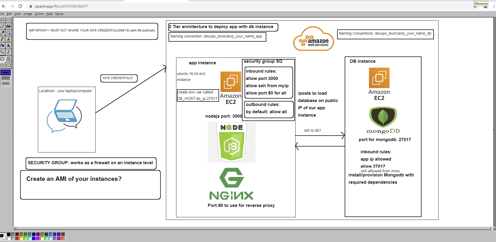

## AWS
# 2 Tier app deployment on AWS

#### Ec2 instance for our node-app
#### Ec2 instance for our DB
#### Networking on AWS with VPC, Subnets, NACLs, Security groups



- Launch an ec2 instance with correct version of ubuntu
- ssh into the instance
- update 
- upgrade
- install nginx 
- access nignx page with public IP
- share the IP in the chat


### Install nodejs with correct version on EC2 instance for our app
```
!/bin/bash

# Update the sources list
sudo apt-get update -y

# upgrade any packages available
sudo apt-get upgrade -y

# install nginx
sudo apt-get install nginx -y

# install git
sudo apt-get install git -y

# install nodejs
sudo apt-get install python-software-properties
curl -sL https://deb.nodesource.com/setup_12.x | sudo -E bash -
sudo apt-get install nodejs -y

# install pm2
sudo npm install pm2 -g
```
### Create reverse proxy so we can load our app without the 3000 port
- `sudo nano /etc/nginx/sites-available/default`
- change the reverse proxy setting to redirect the traffic from 3000 to default port 80
```
server {
    listen 80;

    server_name _;

    location / {
        proxy_pass http://localhost:3000;
        proxy_http_version 1.1;
        proxy_set_header Upgrade $http_upgrade;
        proxy_set_header Connection 'upgrade';
        proxy_set_header Host $host;
        proxy_cache_bypass $http_upgrade;
    }
}


```

### install mongodb on EC2 instance for DB

```
wget -qO - https://www.mongodb.org/static/pgp/server-3.2.asc | sudo apt-key add -

 echo "deb http://repo.mongodb.org/apt/ubuntu xenial/mongodb-org/3.2 multiverse" | sudo tee /etc/apt/sources.list.d/mongodb-org-3.2.list

 sudo apt-get update

 sudo apt-get install -y mongodb-org=3.2.20 mongodb-org-server=3.2.20 mongodb-org-shell=3.2.20 mongodb-org-mongos=3.2.20 mongodb-org-tools=3.2.20


sudo mkdir -p /data/db

 sudo chown -R mongodb:mongodb /var/lib/mongodb

 sudo sed -i 's/127.0.0.1/0.0.0.0/g' /etc/mongod.conf

 sudo systemctl enable mongod

 sudo service mongod start
 ```

 ### Create env variable in our app ec2 to connect to db

```
 sudo echo "export DB_HOST=mongodb://172.31.45.161:27017/posts" >> ~/.bashrc
```
- Source the .bashrc file

- `source ~/.bashrc `
### NETWORK CONFIGURATION

[AWS Networking with VPC, Internet Gateway, Subnets, Route Tables, NACLs, Security Groups](https://towardsdatascience.com/vpc-subnet-and-router-in-aws-cloud-17c8f421af21)